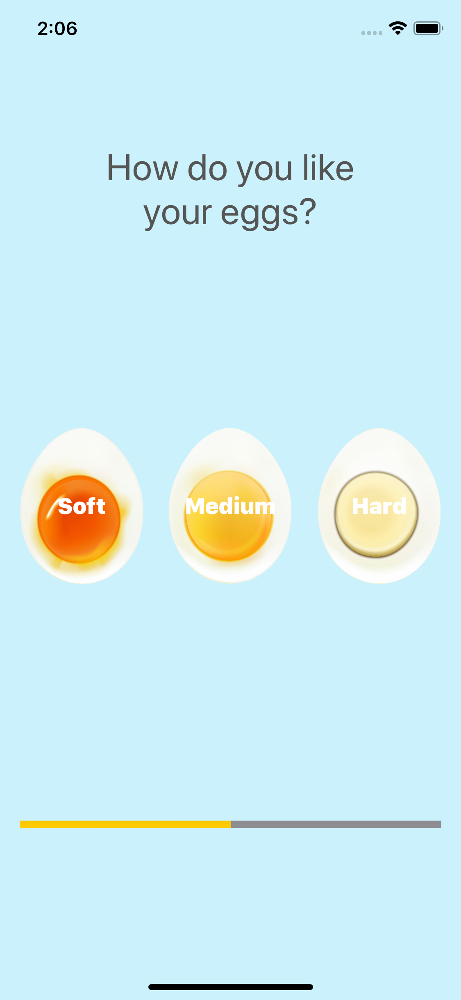

# iOS-EggTimer
This is my "Egg Timer" project from Section 8: Intermediate Swift Programming - Control Flow and Optionals from the Udemy course "iOS 13 & Swift 5 - The Complete iOS App Development Bootcamp"

